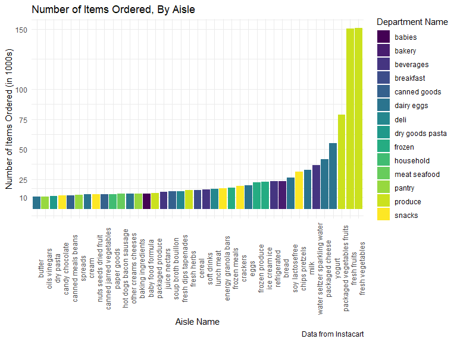
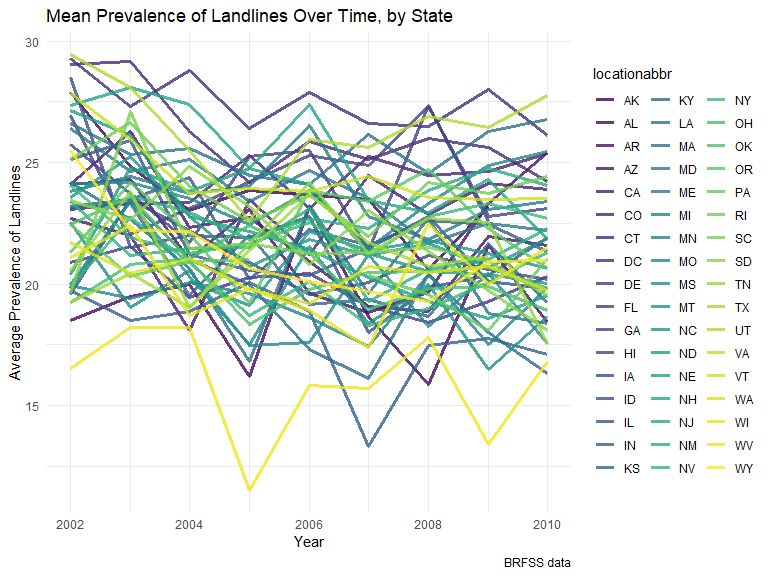
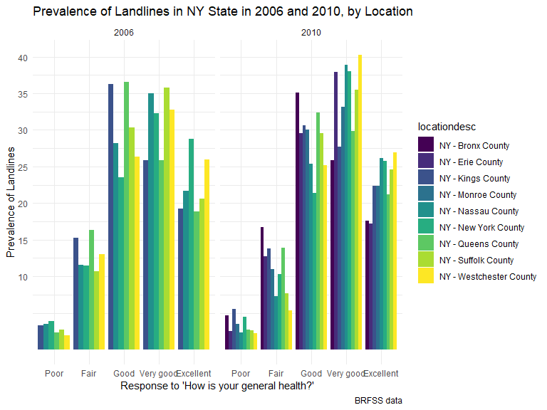
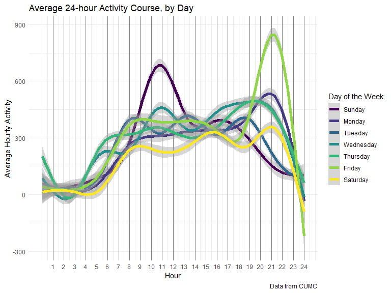

Homework 3 - Visualization and EDA
================
Kristi Chau
10/5/2019


# Problem 1

The `instacart` data set has **1384617** observations and **15**
variables, which gives **20769255** distinct datapoints. There are **0**
missing datapoints in this dataset. Some key variables of this dataset
are: **order\_id**, which ensures all items ordered are associated with
the same order, **user\_id**, who placed the order, **product\_name**,
what product was ordered, and **department**, what department the
product is from. The most orders made by a customer is **100**. The most
popular item ordered is **Banana**.

*1a: How many aisles are there, and which aisles are the most items
ordered from?*

``` r
count_aisles = instacart %>%
  distinct(aisle) %>% 
  count()

most_items_aisle = instacart %>% 
  count(aisle) %>%
  slice(which.max(n))
```

**There are 134 aisles total. The aisle with the most items ordered is
fresh vegetables with a total of 150609 items ordered from that aisle.**

*1b: Make a plot that shows the number of items ordered in each aisle,
limiting this to aisles with more than 10000 items ordered. Arrange
aisles sensibly, and organize your plot so others can read it.*

``` r
instacart_plot = instacart %>% 
  group_by(aisle) %>% 
  mutate(freq = n()) %>% 
  ungroup() %>% 
  mutate(
    aisle = as.factor(aisle),
    aisle = fct_reorder(aisle, freq, na.rm = TRUE)
  )  %>%
  filter(freq > 10000) %>% 
  select(aisle,freq,department) %>% 
  distinct() %>% 
  ggplot(aes(x = aisle, y = freq/1000, fill = department)) +
  geom_col(position = "dodge") +
  labs(
    title = "Number of Items Ordered, By Aisle",
    y = "Number of Items Ordered (in 1000s)",
    x = "Aisle Name",
    caption = "Data from Instacart") +
  theme(
    axis.text.x = element_text(angle = 90,
                               hjust = 1),
    legend.position = "right") + 
  scale_fill_discrete(name = "Department Name") +
  scale_y_continuous(
  breaks = c(10,25,50,75,100,150), 
  labels = c("10","25","50","75","100","150"))

instacart_plot
```



**10,000+ items were ordered from 39 aisles out of the total 134 aisles.
Out of these 39 aisles, the `butter` aisle had the least items ordered,
while `fresh fruits` and `fresh vegetables` had over 150,000 items
ordered, far surpassing the 3rd ranked aisle, which was `packaged
vegetables fruits`, with 78,493 items ordered.**

*1c: Make a table showing the three most popular items in each of the
aisles “baking ingredients”, “dog food care”, and “packaged vegetables
fruits”. Include the number of times each item is ordered in your
table.*

``` r
instacart %>%
  filter(aisle %in% c("baking ingredients", "dog food care", "packaged vegetables fruits")) %>%
  group_by(aisle,product_name) %>%
  mutate(freq = n()) %>%
  arrange(aisle,desc(freq)) %>%
  distinct(aisle,product_name,freq) %>%
  mutate(prod_freq = paste(product_name,freq, sep = "\n")) %>%
  ungroup() %>%
  group_by(aisle) %>%
  mutate(rank = dense_rank(desc(freq))) %>%
  filter(rank %in% c(1,2,3)) %>%
  select(rank,aisle,prod_freq) %>% 
  pivot_wider(
    names_from = "aisle",
    values_from = "prod_freq"
  ) %>% 
  kable(
    caption = "Most Popular Items and Number of Times Each Item was Ordered in 'Baking Ingredients', 'Dog Food Care', and 'Packaged Vegetables Fruits' Aisles",
    col.names = c("Ranking",
                  "Baking Ingredients",
                  "Dog Food Care",
                  "Packaged Vegetables Fruits")
  )
```

<table>

<caption>

Most Popular Items and Number of Times Each Item was Ordered in ‘Baking
Ingredients’, ‘Dog Food Care’, and ‘Packaged Vegetables Fruits’ Aisles

</caption>

<thead>

<tr>

<th style="text-align:right;">

Ranking

</th>

<th style="text-align:left;">

Baking Ingredients

</th>

<th style="text-align:left;">

Dog Food Care

</th>

<th style="text-align:left;">

Packaged Vegetables Fruits

</th>

</tr>

</thead>

<tbody>

<tr>

<td style="text-align:right;">

1

</td>

<td style="text-align:left;">

Light Brown Sugar 499

</td>

<td style="text-align:left;">

Snack Sticks Chicken & Rice Recipe Dog Treats 30

</td>

<td style="text-align:left;">

Organic Baby Spinach 9784

</td>

</tr>

<tr>

<td style="text-align:right;">

2

</td>

<td style="text-align:left;">

Pure Baking Soda 387

</td>

<td style="text-align:left;">

Organix Chicken & Brown Rice Recipe 28

</td>

<td style="text-align:left;">

Organic Raspberries 5546

</td>

</tr>

<tr>

<td style="text-align:right;">

3

</td>

<td style="text-align:left;">

Cane Sugar 336

</td>

<td style="text-align:left;">

Small Dog Biscuits 26

</td>

<td style="text-align:left;">

Organic Blueberries 4966

</td>

</tr>

</tbody>

</table>

**The most popular `Baking Ingredients` items (and frequency of
purchase) are `Light Brown Sugar (499)`, `Pure Baking Soda (387)`, and
`Cane Sugar (336)`. The most popular `Dog Food Care` items (and
frequency of purchase) are `Snack Sticks Chicken & Rice Recipe Dog
Treats (30)` `Organix Chicken & Brown Rice Recipe (28)`, and `Small Dog
Biscuits (26)`. The most popular `Packaged Vegetables Fruits` items (and
frequency of purchase) are `Organic Baby Spinach (9784)`, `Organic
Raspberries (5546)`, and `Organic Blueberries (4966)`.**

*1d: Make a table showing the mean hour of the day at which Pink Lady
Apples and Coffee Ice Cream are ordered on each day of the week; format
this table for human readers (i.e. produce a 2 x 7 table).*

``` r
instacart %>%
  select(product_name,order_dow,order_hour_of_day) %>%
  filter(product_name %in% c("Pink Lady Apples","Coffee Ice Cream")) %>%
  group_by(product_name,order_dow) %>%
  mutate(mean_hod = mean(order_hour_of_day)) %>% 
  distinct(product_name,order_dow,mean_hod) %>%
  arrange(order_dow) %>%
  pivot_wider(
    names_from = "order_dow",
    values_from = "mean_hod"
  ) %>%
  kable(
    caption = "Mean hour of the day, by day of the week, at which Pink Lady Apples and Coffee Ice Cream are ordered",
    col.names = c("Product Name",
                  "Sunday",
                  "Monday",
                  "Tuesday",
                  "Wednesday",
                  "Thursday",
                  "Friday",
                  "Saturday")
  )
```

<table>

<caption>

Mean hour of the day, by day of the week, at which Pink Lady Apples and
Coffee Ice Cream are ordered

</caption>

<thead>

<tr>

<th style="text-align:left;">

Product Name

</th>

<th style="text-align:right;">

Sunday

</th>

<th style="text-align:right;">

Monday

</th>

<th style="text-align:right;">

Tuesday

</th>

<th style="text-align:right;">

Wednesday

</th>

<th style="text-align:right;">

Thursday

</th>

<th style="text-align:right;">

Friday

</th>

<th style="text-align:right;">

Saturday

</th>

</tr>

</thead>

<tbody>

<tr>

<td style="text-align:left;">

Pink Lady Apples

</td>

<td style="text-align:right;">

13.44118

</td>

<td style="text-align:right;">

11.36000

</td>

<td style="text-align:right;">

11.70213

</td>

<td style="text-align:right;">

14.25000

</td>

<td style="text-align:right;">

11.55172

</td>

<td style="text-align:right;">

12.78431

</td>

<td style="text-align:right;">

11.93750

</td>

</tr>

<tr>

<td style="text-align:left;">

Coffee Ice Cream

</td>

<td style="text-align:right;">

13.77419

</td>

<td style="text-align:right;">

14.31579

</td>

<td style="text-align:right;">

15.38095

</td>

<td style="text-align:right;">

15.31818

</td>

<td style="text-align:right;">

15.21739

</td>

<td style="text-align:right;">

12.26316

</td>

<td style="text-align:right;">

13.83333

</td>

</tr>

</tbody>

</table>

**`Pink Lady Apples`, on average, are ordered the earliest on Mondays at
`11.36` hours and the latest on Wednesdays at `14.25` hours. `Coffee Ice
Cream`, on average, is ordered the earliest on Fridays at `12.26` hours
and the latest on Tuesdays at `15.38` hours.**

# Problem 2

*Data Cleaning*

``` r
brfss_df = 
  brfss_smart2010 %>%
  janitor::clean_names() %>%
  filter(topic == "Overall Health") %>%
  arrange(factor(response, levels =  c("Poor","Fair","Good","Very good","Excellent")))
```

**I filtered the data to contain only the Overall Health topic and
arranged the data so responses were ordered from “Poor” to “Excellent”
for the question “How is your general health?” There are 10625
observations in the dataset, with 23 variables. There are 31847 missing
datapoints in this dataset. The average sample size over all locations,
across all states, was 145.9232. This data was collected from 2002 to
2010.**

*2a: In 2002, which states were observed at 7 or more locations? What
about in 2010?*

``` r
brfss_df %>%
  filter(year == 2002) %>%
  distinct(locationabbr,locationdesc) %>%
  count(locationabbr) %>%
  filter(n >= 7)
```

**In 2002, `Connecticut, Florida, Massachusetts, North Carolina, New
Jersey, and Pennsylvania` were observed at 7 or more locations.**

``` r
brfss_df %>%
  filter(year == 2010) %>%
  distinct(locationabbr,locationdesc) %>%
  count(locationabbr) %>%
  filter(n >= 7)
```

**In 2010, `California, Colorado, Flordia, Massachusetts, Maryland,
North Carolina, Nebraska, New Jersey, New York, Ohio, Pennsylvania,
South Carolina, Texas, and Washington` were observed at 7 or more
locations.**

*2b: Construct a dataset that is limited to Excellent responses, and
contains, year, state, and a variable that averages the data\_value
across locations within a state. Make a “spaghetti” plot of this average
value over time within a state (that is, make a plot showing a line for
each state across years – the geom\_line geometry and group aesthetic
will help).*

``` r
brfss_df %>%
  filter(response == "Excellent") %>%
  select(year,locationabbr,data_value) %>%
  group_by(year,locationabbr) %>%
  mutate(avg_data_value = mean(data_value)) %>%
  ggplot(aes(x = year, y = avg_data_value, color = locationabbr)) +
  geom_line(size = 1.25, alpha = 0.8) +
  labs(
    title = "Mean Prevalence of Landlines, Among Those who Responded 'Excellent', Over Time, by State",
    x = "Year",
    y = "Average Prevalence of Landlines",
    caption = "BRFSS data") +
  theme(
   legend.position = "right") +
  scale_colour_discrete (name = "State (and DC)")
```



**Given that we are observing the mean data value across time for all
states in this dataset, it is difficult to see if there are any trends
of prevalence of landline telephones over time among those who responded
“Excellent” unless we focus on individual states or on a smaller subset
of states, like region.**

*2c: Make a two-panel plot showing, for the years 2006, and 2010,
distribution of data\_value for responses (“Poor” to “Excellent”) among
locations in NY State.*

``` r
brfss_df %>%
  filter(year %in% c(2006, 2010), locationabbr == "NY") %>%
  ggplot((aes(x = reorder(response,desc(display_order)), y = data_value, fill = locationdesc))) +
  geom_col(position = "dodge") + 
  labs(
    title = "Prevalence of Landlines in NY State in 2006 and 2010, by Location",
    x = "Response to 'How is your general health?'",
    y = "Prevalence of Landlines",
    caption = "BRFSS data") +
  facet_grid(~year) +
  theme(legend.position = "right") +
  scale_y_continuous(
    breaks = c(10,15,20,25,30,35,40,45))
```



**The distribution of data\_value (the prevalence of landlines) for
responses among locations in NY State seem to follow similar patterns
between 2006 and 2010. The prevalence of landlines was lowest among
those who responded that their general health was “poor”Poor" across all
locations in 2006 and 2010, followed by “Fair” and “Excellent”
responses. Depending on location, the prevalence of landlines was
highest in those who responded “Good” or “Very good”.**

# Problem 3

*3a: Load, tidy, and otherwise wrangle the data. Your final dataset
should include all originally observed variables and values; have useful
variable names; include a weekday vs weekend variable; and encode data
with reasonable variable classes. Describe the resulting dataset
(e.g. what variables exist, how many observations, etc).*

``` r
accel_data = read_csv("./data/accel_data.csv", col_types = cols(
  week = col_integer(),
  day_id = col_integer()
)) %>%
  janitor::clean_names() %>%
  pivot_longer(
    activity_1:activity_1440,
    names_to = "activity",
    names_prefix = "activity_",
    names_ptypes = list(activity = integer()),
    values_to = "counts"
  ) %>% 
  mutate(day_end = ifelse(day %in% c("Saturday","Sunday"),"weekend","weekday"))
```

**The variables in this dataset are week, day\_id, day, activity,
counts, day\_end There are 50400 rows and 6 columns for a total of
302400 observations. This patient was observed for 35 days and had a
mean activity count of 267.04 per minute.**

*3b: Traditional analyses of accelerometer data focus on the total
activity over the day. Using your tidied dataset, aggregate across
minutes to create a total activity variable for each day, and create a
table showing these totals. Are any trends apparent?*

``` r
accel_data %>%
  mutate(
    day = factor(day, levels = c("Sunday", "Monday", "Tuesday", "Wednesday", "Thursday", "Friday", "Saturday", ordered = TRUE)),
    day_num = as.integer(day)
  ) %>%
  group_by(week, day_num) %>%
  mutate(total_activity = sum(counts)) %>%
  ungroup() %>%
  arrange(week,day_num) %>%
  distinct(week,day,total_activity) %>%
  pivot_wider(
    names_from = "day",
    values_from = "total_activity"
  ) %>% 
  kable(
    caption = "Total Daily Activity over 5 weeks"
  )
```

<table>

<caption>

Total Daily Activity over 5 weeks

</caption>

<thead>

<tr>

<th style="text-align:right;">

week

</th>

<th style="text-align:right;">

Sunday

</th>

<th style="text-align:right;">

Monday

</th>

<th style="text-align:right;">

Tuesday

</th>

<th style="text-align:right;">

Wednesday

</th>

<th style="text-align:right;">

Thursday

</th>

<th style="text-align:right;">

Friday

</th>

<th style="text-align:right;">

Saturday

</th>

</tr>

</thead>

<tbody>

<tr>

<td style="text-align:right;">

1

</td>

<td style="text-align:right;">

631105

</td>

<td style="text-align:right;">

78828.07

</td>

<td style="text-align:right;">

307094.2

</td>

<td style="text-align:right;">

340115

</td>

<td style="text-align:right;">

355923.6

</td>

<td style="text-align:right;">

480542.6

</td>

<td style="text-align:right;">

376254

</td>

</tr>

<tr>

<td style="text-align:right;">

2

</td>

<td style="text-align:right;">

422018

</td>

<td style="text-align:right;">

295431.00

</td>

<td style="text-align:right;">

423245.0

</td>

<td style="text-align:right;">

440962

</td>

<td style="text-align:right;">

474048.0

</td>

<td style="text-align:right;">

568839.0

</td>

<td style="text-align:right;">

607175

</td>

</tr>

<tr>

<td style="text-align:right;">

3

</td>

<td style="text-align:right;">

467052

</td>

<td style="text-align:right;">

685910.00

</td>

<td style="text-align:right;">

381507.0

</td>

<td style="text-align:right;">

468869

</td>

<td style="text-align:right;">

371230.0

</td>

<td style="text-align:right;">

467420.0

</td>

<td style="text-align:right;">

382928

</td>

</tr>

<tr>

<td style="text-align:right;">

4

</td>

<td style="text-align:right;">

260617

</td>

<td style="text-align:right;">

409450.00

</td>

<td style="text-align:right;">

319568.0

</td>

<td style="text-align:right;">

434460

</td>

<td style="text-align:right;">

340291.0

</td>

<td style="text-align:right;">

154049.0

</td>

<td style="text-align:right;">

1440

</td>

</tr>

<tr>

<td style="text-align:right;">

5

</td>

<td style="text-align:right;">

138421

</td>

<td style="text-align:right;">

389080.00

</td>

<td style="text-align:right;">

367824.0

</td>

<td style="text-align:right;">

445366

</td>

<td style="text-align:right;">

549658.0

</td>

<td style="text-align:right;">

620860.0

</td>

<td style="text-align:right;">

1440

</td>

</tr>

</tbody>

</table>

**There are no obvious trends in this data. Tuesdays, Wednesdays, and
Thursdays, the patient seems to have a somewhat consistent level of
activity, while activity level varies more widely for Sunday, Monday,
Friday, and Saturday. On the last 2 Saturdays of observation, it appears
that the patient was not active.**

*3c: Accelerometer data allows the inspection activity over the course
of the day. Make a single-panel plot that shows the 24-hour activity
time courses for each day and use color to indicate day of the week.
Describe in words any patterns or conclusions you can make based on this
graph.*

``` r
accel_data %>%
  mutate(
    day = ordered(day,levels = c("Sunday", "Monday", 
    "Tuesday", "Wednesday", "Thursday", "Friday", "Saturday"))) %>%
  ggplot(aes(x = activity, y = counts, color = day)) +
  geom_smooth(size = 2) +
  labs(
    title = "Average 24-hour Activity Course, by Day",
    x = "Hour",
    y = "Average Hourly Activity",
    caption = "Data from CUMC") +
  theme(
    legend.position = "right",
    panel.grid.major.x = element_line(color = "grey50")
  ) + 
  scale_colour_discrete(name = "Day of the Week") +
  scale_x_continuous(
  breaks = c(60,120,180,240,300,360,420,480,540,600,660,720,780,840,900,960,1020,1080,1140,1200,1260,1320,1380,1440), 
  labels = c("1","2","3","4","5","6","7","8","9","10","11","12","13","14","15","16","17","18","19","20","21","22","23","24"))
```



**On average, there was a period of high activity on Friday nights,
peaking around 9-9:30pm. On Sundays, there was a period of high activity
that peaked around 10:30-11am. On average, Saturdays appear to have the
least amount of activity across the 5 weeks.**
