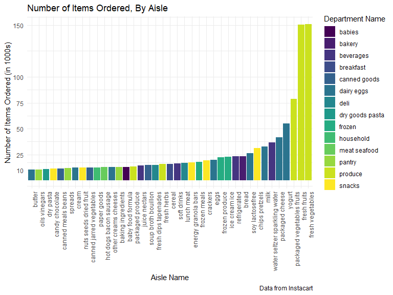

Homework 3 - Visualization and EDA
================
Kristi Chau
10/5/2019


# Problem 1

The `instacart` data set has **1384617** observations and **15**
variables, which gives **20769255** distinct datapoints. Some key
variables of this dataset are: **order\_id**, which ensures all items
ordered are associated with the same order, **user\_id**, who placed the
order, **product\_name**, what product was ordered, and **department**,
what department the product is from. The most orders made by a customer
is **100**. The most popular item ordered is
**Banana**.

## Problem 1a: How many aisles are there, and which aisles are the most items ordered from?

``` r
count_aisles = instacart %>%
  distinct(aisle) %>% 
  count()

most_items_aisle = instacart %>% 
  count(aisle) %>%
  slice(which.max(n))
```

**There are 134 aisles total. The aisle with the most items ordered is
fresh vegetables with a total of 150609 items ordered from that
aisle.**

## Problem 1b: Make a plot that shows the number of items ordered in each aisle, limiting this to aisles with more than 10000 items ordered. Arrange aisles sensibly, and organize your plot so others can read it.

``` r
instacart_plot = instacart %>% 
  group_by(aisle) %>% 
  mutate(freq = n()) %>% 
  ungroup() %>% 
  mutate(
    aisle = as.factor(aisle),
    aisle = fct_reorder(aisle, freq, na.rm = TRUE)
  )  %>%
  filter(freq > 10000) %>% 
  select(aisle,freq,department) %>% 
  distinct() %>% 
  ggplot(aes(x = aisle, y = freq/1000, fill = department)) +
  geom_col(position = "dodge") +
  labs(
    title = "Number of Items Ordered, By Aisle",
    y = "Number of Items Ordered (in 1000s)",
    x = "Aisle Name",
    caption = "Data from Instacart") +
  theme(
    axis.text.x = element_text(angle = 90),
    legend.position = "right") + 
  scale_fill_discrete(name = "Department Name") +
  scale_y_continuous(
  breaks = c(10,25,50,75,100,150), 
  labels = c("10","25","50","75","100","150"))

instacart_plot
```



**10,000+ items were ordered from 39 aisles out of the total 134 aisles.
Out of these 39 aisles, the `butter` aisle had the least items ordered,
while `fresh fruits` and `fresh vegetables` had over 150,000 items
ordered, far surpassing the 3rd ranked aisle, which was `packaged
vegetables fruits`, with 78,493 items
ordered.**

## Problem 1c: Make a table showing the three most popular items in each of the aisles “baking ingredients”, “dog food care”, and “packaged vegetables fruits”. Include the number of times each item is ordered in your table.

``` r
instacart %>%
  group_by(aisle,product_name) %>%
  filter(aisle %in% c("baking ingredients", "dog food care", "packaged vegetables fruits")) %>%
  mutate(freq = n()) %>%
  arrange(aisle,desc(freq)) %>%
  distinct(aisle,product_name,freq) %>%
  ungroup() %>% 
  group_by(aisle) %>%
  mutate(rank = dense_rank(desc(freq))) %>%
  filter(rank %in% c(1,2,3)) %>%
  select(aisle,rank,product_name,freq) %>% 
  kable(
    caption = "Most popular items in 'Baking Ingredients', 'Dog Food Care', and 'Packaged Vegetables Fruits' Aisles",
    col.names = c("Aisle Name",
                  "Ranking",
                  "Product Name",
                  "Number of Items Purchased"))
```

<table>

<caption>

Most popular items in ‘Baking Ingredients’, ‘Dog Food Care’, and
‘Packaged Vegetables Fruits’ Aisles

</caption>

<thead>

<tr>

<th style="text-align:left;">

Aisle Name

</th>

<th style="text-align:right;">

Ranking

</th>

<th style="text-align:left;">

Product Name

</th>

<th style="text-align:right;">

Number of Items Purchased

</th>

</tr>

</thead>

<tbody>

<tr>

<td style="text-align:left;">

baking ingredients

</td>

<td style="text-align:right;">

1

</td>

<td style="text-align:left;">

Light Brown Sugar

</td>

<td style="text-align:right;">

499

</td>

</tr>

<tr>

<td style="text-align:left;">

baking ingredients

</td>

<td style="text-align:right;">

2

</td>

<td style="text-align:left;">

Pure Baking Soda

</td>

<td style="text-align:right;">

387

</td>

</tr>

<tr>

<td style="text-align:left;">

baking ingredients

</td>

<td style="text-align:right;">

3

</td>

<td style="text-align:left;">

Cane Sugar

</td>

<td style="text-align:right;">

336

</td>

</tr>

<tr>

<td style="text-align:left;">

dog food care

</td>

<td style="text-align:right;">

1

</td>

<td style="text-align:left;">

Snack Sticks Chicken & Rice Recipe Dog Treats

</td>

<td style="text-align:right;">

30

</td>

</tr>

<tr>

<td style="text-align:left;">

dog food care

</td>

<td style="text-align:right;">

2

</td>

<td style="text-align:left;">

Organix Chicken & Brown Rice Recipe

</td>

<td style="text-align:right;">

28

</td>

</tr>

<tr>

<td style="text-align:left;">

dog food care

</td>

<td style="text-align:right;">

3

</td>

<td style="text-align:left;">

Small Dog Biscuits

</td>

<td style="text-align:right;">

26

</td>

</tr>

<tr>

<td style="text-align:left;">

packaged vegetables fruits

</td>

<td style="text-align:right;">

1

</td>

<td style="text-align:left;">

Organic Baby Spinach

</td>

<td style="text-align:right;">

9784

</td>

</tr>

<tr>

<td style="text-align:left;">

packaged vegetables fruits

</td>

<td style="text-align:right;">

2

</td>

<td style="text-align:left;">

Organic Raspberries

</td>

<td style="text-align:right;">

5546

</td>

</tr>

<tr>

<td style="text-align:left;">

packaged vegetables fruits

</td>

<td style="text-align:right;">

3

</td>

<td style="text-align:left;">

Organic Blueberries

</td>

<td style="text-align:right;">

4966

</td>

</tr>

</tbody>

</table>

**The 3 most popular `Baking Ingredients` items are `Light Brown Sugar`,
`Pure Baking Soda`, and `Cane Sugar`. The 3 most popular `Dog Food Care`
items are `Snack Sticks Chicken & Rice Recipe Dog Treats` `Organix
Chicken & Brown Rice Recipe`, and `Small Dog Biscuits`. The 3 most
popular `Packaged Vegetables Fruits` items are `Organic Baby Spinach`,
`Organic Raspberries`, and `Organic
Blueberries`.**

## Problem 1d: Make a table showing the mean hour of the day at which Pink Lady Apples and Coffee Ice Cream are ordered on each day of the week; format this table for human readers (i.e. produce a 2 x 7 table).

``` r
instacart %>%
  select(product_name,order_dow,order_hour_of_day) %>%
  filter(product_name %in% c("Pink Lady Apples","Coffee Ice Cream")) %>%
  group_by(product_name,order_dow) %>%
  mutate(mean_hod = mean(order_hour_of_day)) %>% 
  distinct(product_name,order_dow,mean_hod) %>%
  arrange(order_dow) %>%
  pivot_wider(
    names_from = "order_dow",
    values_from = "mean_hod"
  ) %>%
  kable(
    caption = "Mean hour of the day, by day of the week, at which Pink Lady Apples and Coffee Ice Cream are ordered",
    col.names = c("Product Name",
                  "Sunday",
                  "Monday",
                  "Tuesday",
                  "Wednesday",
                  "Thursday",
                  "Friday",
                  "Saturday")
  )
```

<table>

<caption>

Mean hour of the day, by day of the week, at which Pink Lady Apples and
Coffee Ice Cream are ordered

</caption>

<thead>

<tr>

<th style="text-align:left;">

Product Name

</th>

<th style="text-align:right;">

Sunday

</th>

<th style="text-align:right;">

Monday

</th>

<th style="text-align:right;">

Tuesday

</th>

<th style="text-align:right;">

Wednesday

</th>

<th style="text-align:right;">

Thursday

</th>

<th style="text-align:right;">

Friday

</th>

<th style="text-align:right;">

Saturday

</th>

</tr>

</thead>

<tbody>

<tr>

<td style="text-align:left;">

Pink Lady Apples

</td>

<td style="text-align:right;">

13.44118

</td>

<td style="text-align:right;">

11.36000

</td>

<td style="text-align:right;">

11.70213

</td>

<td style="text-align:right;">

14.25000

</td>

<td style="text-align:right;">

11.55172

</td>

<td style="text-align:right;">

12.78431

</td>

<td style="text-align:right;">

11.93750

</td>

</tr>

<tr>

<td style="text-align:left;">

Coffee Ice Cream

</td>

<td style="text-align:right;">

13.77419

</td>

<td style="text-align:right;">

14.31579

</td>

<td style="text-align:right;">

15.38095

</td>

<td style="text-align:right;">

15.31818

</td>

<td style="text-align:right;">

15.21739

</td>

<td style="text-align:right;">

12.26316

</td>

<td style="text-align:right;">

13.83333

</td>

</tr>

</tbody>

</table>

**`Pink Lady Apples`, on average, are ordered the earliest on Mondays at
`11.36` hours and the latest on Wednesdays at `14.25` hours. `Coffee Ice
Cream`, on average, is ordered the earliest on Fridays at `12.26` hours
and the latest on Tuesdays at `15.38` hours.**

# Problem 2

## Data Cleaning

``` r
brfss_df = 
  brfss_smart2010 %>%
  janitor::clean_names() %>%
  filter(topic == "Overall Health") %>%
  arrange(factor(response, levels =  c("Poor","Fair","Good","Very good","Excellent")))
```

## Problem 2a: In 2002, which states were observed at 7 or more locations? What about in 2010?

``` r
brfss_df %>%
  filter(year == 2002) %>%
  distinct(locationabbr,locationdesc) %>%
  count(locationabbr) %>%
  filter(n >= 7)
```

    ## # A tibble: 6 x 2
    ##   locationabbr     n
    ##   <chr>        <int>
    ## 1 CT               7
    ## 2 FL               7
    ## 3 MA               8
    ## 4 NC               7
    ## 5 NJ               8
    ## 6 PA              10

**In 2002, `Connecticut, Florida, Massachusetts, North Carolina, New
Jersey, and Pennsylvania` were observed at 7 or more locations.**

``` r
brfss_df %>%
  filter(year == 2010) %>%
  distinct(locationabbr,locationdesc) %>%
  count(locationabbr) %>%
  filter(n >= 7)
```

    ## # A tibble: 14 x 2
    ##    locationabbr     n
    ##    <chr>        <int>
    ##  1 CA              12
    ##  2 CO               7
    ##  3 FL              41
    ##  4 MA               9
    ##  5 MD              12
    ##  6 NC              12
    ##  7 NE              10
    ##  8 NJ              19
    ##  9 NY               9
    ## 10 OH               8
    ## 11 PA               7
    ## 12 SC               7
    ## 13 TX              16
    ## 14 WA              10

**In 2010, `California, Colorado, Flordia, Massachusetts, Maryland,
North Carolina, Nebraska, New Jersey, New York, Ohio, Pennsylvania,
South Carolina, Texas, and Washington` were observed at 7 or more
locations.**

## Problem 2b: Construct a dataset that is limited to Excellent responses, and contains, year, state, and a variable that averages the data\_value across locations within a state. Make a “spaghetti” plot of this average value over time within a state (that is, make a plot showing a line for each state across years – the geom\_line geometry and group aesthetic will help).

``` r
brfss_df %>%
  filter(response == "Excellent") %>%
  select(year,locationabbr,data_value) %>%
  group_by(year,locationabbr) %>%
  mutate(avg_data_value = mean(data_value)) %>%
  ggplot(aes(x = year, y = avg_data_value, color = locationabbr)) +
  geom_line(size = 1.25, alpha = 0.8) +
  labs(
    title = "Mean Prevalence of Landlines Over Time, by State",
    x = "Year",
    y = "Average Prevalence of Landlines",
    caption = "BRFSS data") +
  theme(
   legend.position = "right")
```


**Given that we are observing the mean data value across time for all
states in this dataset, it is difficult to see if there are any trends
of prevalence of landline telephones over time unless we focus on
individual states or on a smaller subset of
states.**

## Problem 2c: Make a two-panel plot showing, for the years 2006, and 2010, distribution of data\_value for responses (“Poor” to “Excellent”) among locations in NY State.

``` r
brfss_df %>%
  filter(year %in% c(2006, 2010), locationabbr == "NY") %>%
  ggplot((aes(x = reorder(response,desc(display_order)), y = data_value, fill = locationdesc))) +
  geom_col(position = "dodge") + 
  labs(
    title = "Prevalence of Landlines in NY State in 2006 and 2010, by Location",
    x = "Response to 'How is your general health?'",
    y = "Prevalence of Landlines",
    caption = "BRFSS data") +
  facet_grid(~year) +
  theme(legend.position = "right") +
  scale_y_continuous(
    breaks = c(10,15,20,25,30,35,40,45))
```


**The distribution of data\_value (the prevalence of landlines) for
responses among locations in NY State seem to follow similar patterns
between 2006 and 2010. The prevalence of landlines was lowest among
those who responded that their general health was poor across all
locations in 2006 and 2010, followed by “Fair” and “Excellent”
responses. Depending on location, the prevalence of landlines was
highest in those who responded “Good” or “Very good”.**
